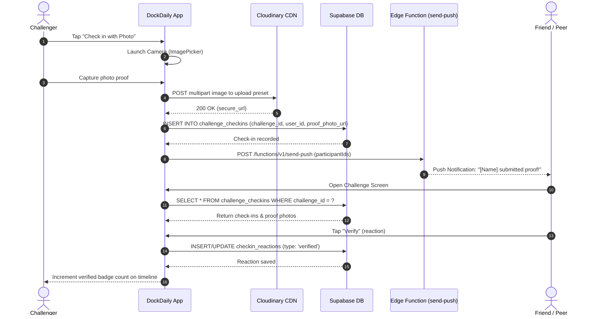

# DockDaily 🎯

> **Offline-First Hybrid Task, Habit & Social Accountability System for Mobile**  
> Built with React Native 0.81.5, React 19, Expo SDK 54, Expo Router v6, SQLite, Supabase, and Sentry.

---

## 📑 Table of Contents
1. [Executive Summary](#-executive-summary)
2. [Architectural Overview & System Design](#-architectural-overview--system-design)
3. [End-to-End Data & Request Flow Trace](#-end-to-end-data--request-flow-trace)
4. [Component & System Architecture (Mermaid Diagrams)](#-component--system-architecture-mermaid-diagrams)
5. [Repository Directory & Module Breakdown](#-repository-directory--module-breakdown)
6. [Product Manager Lens: Core Features & User Flows](#-product-manager-lens-core-features--user-flows)
7. [Developer Onboarding: Top 5 Files to Read First](#-developer-onboarding-top-5-files-to-read-first)
8. [Code Risks, Security Concerns & Technical Debt](#-code-risks-security-concerns--technical-debt)
9. [Local Development & Setup Guide](#-local-development--setup-guide)

---

## 🔭 Executive Summary

### The Problem
Modern mobile productivity tools suffer from two extremes:
1. **Siloed Complexity**: Users are forced to juggle separate apps for task management (to-dos), habit tracking (streaks), and social accountability (peer challenges).
2. **Cloud Fragility**: Most apps require a constant internet connection, introducing UI latency, spinner states, and failure modes when traveling or in low-connectivity environments.
3. **Streak Discouragement**: Traditional habit trackers penalize users harshly for a single missed day, leading to the "what-the-hell" effect where users abandon their streaks entirely.

### The Solution: DockDaily
DockDaily is an **offline-first, zero-latency daily productivity engine** designed for iOS and Android. It merges:
- **Daily Task Management**: Rapid creation, drag-and-drop prioritization, bulk operations, and granular date/time reminders.
- **Resilient Habit Tracking**: Support for Boolean (Yes/No), Count (e.g., 8 glasses), and Duration (e.g., 30 mins) habits, coupled with a **21-Day History Matrix** featuring a **48-Hour Backfill Grace Period** (Today & Yesterday editable, older days locked) to maintain streak integrity without punitive rigidity.
- **Streak Rescue & AI Guidance**: Automated detection of broken 3+ day streaks that deploys contextual AI reframing cards alongside personalized habit coaching and weekly trend analysis.
- **Social Accountability & Peer Challenges**: Multi-user habit challenges (Formal vs. Informal) with camera photo proof capture, Cloudinary CDN delivery, peer reactions (`verified` / `flagged`), and friend invite codes.
- **Local-First SQLite Core with Asynchronous Cloud Sync**: All operations commit immediately to a local SQLite database (`dockdaily.db`) with zero network wait time, debouncing synchronization (`800ms`) with a remote Supabase (PostgreSQL) backend when signed in.

---

## 🏛️ Architectural Overview & System Design

### Architecture Pillars
```
┌────────────────────────────────────────────────────────────────────────┐
│                        PRESENTATION LAYER (UI)                         │
│   Expo Router (Tabs & Modals)  │  Reanimated 4  │  Gesture Handler 2   │
└───────────────────────────────────┬────────────────────────────────────┘
                                    │
                                    ▼
┌────────────────────────────────────────────────────────────────────────┐
│                   STATE MANAGEMENT & ORCHESTRATION                     │
│    Zustand Domain Stores (Tasks, Habits, Challenges, Auth, Insights)   │
│         Dynamic Inter-Store Bridges (challengeSync, syncScheduler)     │
└───────────────────┬────────────────────────────────┬───────────────────┘
                    │                                │
                    ▼                                ▼
┌──────────────────────────────────────┐  ┌──────────────────────────────┐
│          LOCAL STORAGE ENGINE        │  │     REMOTE BACKEND ENGINE    │
│  expo-sqlite (Local Relational DB)   │  │  Supabase (PostgreSQL + RLS) │
│  expo-secure-store (Auth / Cache)    │  │  Supabase Edge Functions     │
│  Tombstone Table (deleted_records)   │  │  Cloudinary CDN (Photo Proof)│
└──────────────────────────────────────┘  └──────────────────────────────┘
```

### 1. Offline-First Relational Model (`expo-sqlite`)
- All user modifications (writes, updates, completions, reorders) write directly to the local SQLite database (`dockdaily.db`) via `expo-sqlite`.
- Every local record maintains a `synced` flag (`0 = pending`, `1 = synced`).
- Deletions write a tombstone record to `deleted_records` (`table_name`, `record_id`, `deleted_at`) to guarantee that offline deletions propagate cleanly to the cloud upon reconnection without resurrecting records.

### 2. Debounced Asynchronous Cloud Sync (`useSyncStore`)
- When authenticated via Google OAuth, store operations call `scheduleSync()`.
- `scheduleSync()` enforces an **800ms debounce timer**, batching burst mutations into a single network cycle.
- **Push Cycle**:
  1. Purges remote records matching local `deleted_records` (tasks and habits with cascade delete on logs).
  2. Pushes unsynced tasks, habits, and habit logs via Supabase `upsert` with explicit `onConflict` clauses.
  3. Updates local records to `synced = 1`.
- **Pull Cycle**:
  1. Queries remote tables filtered by `user_id`.
  2. Removes local orphaned synced items (deleted on another device).
  3. Reconciles differences using `updated_at` timestamps (Last-Write-Wins).
  4. Reloads active Zustand stores.

### 3. Bidirectional Challenge-Habit Bridge (`challengeSync.ts`)
- Habits and Challenges are loosely coupled. A user can link an existing local habit to an incoming challenge.
- When `useHabitStore.logHabitForDate()` completes a habit for today, it asynchronously triggers `syncHabitToChallenge()`.
- If the linked challenge requires proof, the app invokes `captureProofPhoto()`; otherwise, it submits the check-in immediately.
- Conversely, completing a challenge check-in invokes `syncChallengeToHabit()`, keeping local habit logs synchronized without circular dependency locks.

---

## 🔄 End-to-End Data & Request Flow Trace

### Flow 1: Cold Start & App Initialization
```
1. Root Mounting (app/_layout.tsx wrapped in Sentry)
   │
   ├──> getDatabase() ──> Open 'dockdaily.db', PRAGMA foreign_keys = ON
   │    └──> Run DDL: CREATE TABLE IF NOT EXISTS (tasks, habits, habit_logs, deleted_records)
   │    └──> Execute idempotent schema migrations (sort_order, reminder_time, reminder_date, last_known_streak)
   │
   ├──> usePreferenceStore.loadPreferences() ──> Load theme & notifications from SecureStore
   │
   ├──> useAuthStore.loadSession() ──> Retrieve Supabase JWT from SecureStore
   │    └──> If session exists: registerPushToken() & update Supabase 'profiles.push_token'
   │
   ├──> useHabitStore.loadAllLogs() ──> Query local habit_logs
   │    └──> useRescueStore.runRescueCheck() ──> Check for streaks dropped from >=3 to 0
   │         └──> If broken streaks found: Fetch AI motivational rescue message from Edge Function
   │
   ├──> Refresh Reminders:
   │    ├──> refreshHabitReminders() ──> Schedule Expo local notifications for habits
   │    └──> refreshTaskReminders()  ──> Schedule Expo local notifications for tasks
   │
   └──> Set dbReady = true ──> Render Navigation Stack
```

### Flow 2: Task / Habit Mutation & Sync Cycle
```
User checks off a task or habit in UI
   │
   ├──> Immediate Local Execution:
   │    ├──> Database write: UPDATE tasks/habit_logs SET completed = 1, synced = 0 WHERE id = ?
   │    ├──> Recalculate streak via calculateStreak() & update 'last_known_streak'
   │    ├──> Refresh active Zustand store state (instant UI reactivity)
   │    └──> Trigger tactile haptic feedback (expo-haptics) & celebration animation
   │
   ├──> Background Debounce (800ms):
   │    └──> syncScheduler.scheduleSync()
   │         └──> useSyncStore.syncAll()
   │              ├──> Push Phase:
   │              │    ├──> Query deleted_records ──> DELETE FROM remote tasks/habits
   │              │    ├──> Query where synced = 0 ──> Supabase UPSERT tasks/habits/logs
   │              │    └──> UPDATE local SET synced = 1
   │              └──> Pull Phase:
   │                   ├──> SELECT FROM remote where user_id = auth.uid()
   │                   ├──> Delete local records removed on remote
   │                   └──> UPSERT remote changes into local SQLite if updated_at > local.updated_at
```

### Flow 3: Photo Proof Challenge Submission
```
User taps "Check in" in Challenge Detail Screen (app/challenge/[id].tsx)
   │
   ├──> Check if challenge.requiresProof === true
   │    └──> captureProofPhoto() (utils/challengeProof.ts)
   │         ├──> Request camera permission (expo-image-picker)
   │         ├──> Launch native camera with 0.6 compression
   │         ├──> Multi-part POST to Cloudinary CDN: api.cloudinary.com/v1_1/<cloud>/image/upload
   │         └──> Return secure image URL
   │
   ├──> submitCheckin(challengeId, photoUrl) (store/useChallengeStore.ts)
   │    └──> INSERT INTO Supabase 'challenge_checkins'
   │
   ├──> Notify Participants:
   │    └──> sendPush(participantIds, title, body) (utils/pushNotify.ts)
   │         └──> POST /functions/v1/send-push
   │
   └──> Update Local Challenge Timeline & Trigger syncChallengeToHabit()
```

---

## 📊 Component & System Architecture (Mermaid Diagrams)

### System Architecture Diagram
```mermaid
flowchart TD
    subgraph Client ["Client Device (React Native / Expo SDK 54)"]
        subgraph UI ["Presentation Layer (Expo Router)"]
            T_Today["Today Screen (index.tsx)"]
            T_Tasks["Tasks Screen (tasks.tsx)"]
            T_Habits["Habits Screen (habits.tsx)"]
            T_Challenges["Challenges Screen (challenges.tsx)"]
            T_Stats["Stats Screen (stats.tsx)"]
            M_History["Habit History Sheet (21-Day Matrix)"]
            M_Rescue["Habit Rescue Card"]
            M_Drawer["Reminder Drawer"]
        end

        subgraph State ["Zustand State Layer"]
            S_Task["useTaskStore"]
            S_Habit["useHabitStore"]
            S_Challenge["useChallengeStore"]
            S_Auth["useAuthStore"]
            S_Sync["useSyncStore"]
            S_Rescue["useRescueStore"]
            S_AI["useAIStore / useChatStore / useInsightsStore"]
        end

        subgraph LocalStorage ["Local Persistence Engine"]
            DB[("SQLite Database: dockdaily.db\n(tasks, habits, habit_logs, deleted_records)")]
            SecureStore[("Expo SecureStore\n(Auth Tokens, AI Cache, Prefs)")]
            Notifs["Expo Notifications Engine\n(Local Daily & Smart Reminders)"]
        end
    end

    subgraph Cloud ["Cloud & Backend Infrastructure"]
        subgraph Supabase ["Supabase Platform (AWS)"]
            Auth["Supabase Auth (Google OAuth)"]
            PG[("PostgreSQL Database\n(RLS Protected Tables)")]
            Storage["Supabase Storage"]
            subgraph EdgeFunctions ["Edge Functions (Deno / TypeScript)"]
                EF_Push["send-push"]
                EF_Rescue["habit-rescue"]
                EF_Insights["weekly-insights"]
                EF_Ask["ask-habits"]
                EF_Match["match-habit"]
                EF_Suggestions["habit-suggestions"]
                EF_Invite["accept-invite"]
                EF_Delete["delete-account"]
            end
        end

        subgraph ExternalServices ["External Services"]
            Groq["Groq AI / OpenAI LLM APIs"]
            Cloudinary["Cloudinary CDN (Photo Proofs)"]
            Sentry["Sentry Dashboard (Crash & Feedback)"]
            EAS["Expo Push Notification Service"]
        end
    end

    UI --> State
    State <--> LocalStorage
    S_Sync <-->|Debounced Sync (800ms)| PG
    S_Auth <--> Auth
    S_AI --> EdgeFunctions
    S_Rescue --> EF_Rescue
    EdgeFunctions --> Groq
    UI -.->|Camera Upload| Cloudinary
    UI -.->|Crash/Feedback| Sentry
    Notifs -.->|Token Registration| EAS
    EF_Push --> EAS
```

### Social Challenge Verification & Check-In Sequence Diagram


---

## 📁 Repository Directory & Module Breakdown

| Directory / File | Core Responsibility | Key Technologies / Patterns |
| :--- | :--- | :--- |
| **`app/`** | Expo Router file-based route definitions | Expo Router v6, Stack & Tab Navigation |
| ├── `app/_layout.tsx` | App root lifecycle, Sentry wrapper, DB & auth initialization, foreground sync handler | Sentry, AppState listener, push token registration |
| ├── `app/(tabs)/` | 5 main tab screens (`index`, `tasks`, `habits`, `challenges`, `stats`) | Tab layout with custom icons & haptic feedback |
| │   ├── `index.tsx` | Today screen: live greeting, progress bar, rescue cards, combined habits/tasks lists | Animated progress, pull-to-refresh, celebration triggers |
| │   ├── `tasks.tsx` | Tasks screen: drag-and-drop sort, bulk selection, priority chips, reminders | `react-native-draggable-flatlist`, search filtering |
| │   ├── `habits.tsx` | Habits screen: Boolean/Count/Duration steppers, streak counts, history sheet trigger | Stepper math, 21-day modal launcher |
| │   ├── `challenges.tsx` | Challenges screen: active/invited challenges, leaderboards, join modal | Multi-user filtering, invite response |
| │   └── `stats.tsx` | Analytics screen: 7-day activity bars, 14-day history, AI weekly insights, habit coach | SecureStore cached AI insights, SVG/view bar chart |
| ├── `app/challenge/[id].tsx` | Challenge detail: social photo timeline, verification lightbox, reaction toggles | Photo lightbox modal, peer reaction RPC |
| ├── `app/create-challenge.tsx` | Modal form to configure new challenge (formal vs informal, proof requirement) | Date picker, friend multi-select |
| ├── `app/friends.tsx` | Friends management: 7-character invite code generation, code redemption | Ambiguity-free random code generator, Share API |
| ├── `app/profile.tsx` | Account management, Google OAuth, theme toggle, JSON backup export/import | GDPR account deletion, JSON serialization |
| **`components/`** | Specialized sheets, modals, and reusable themed UI controls | Gorhom-inspired bottom sheet patterns, Reanimated |
| ├── `HabitHistorySheet.tsx` | 21-day habit completion matrix with 48h editable backfill grace window | Date-fns window math, streak preservation locks |
| ├── `HabitRescueCard.tsx` | Motivational rescue card displayed on Today tab when streaks break | Inline AI card with dismiss action |
| ├── `ReminderDrawer.tsx` | Modal time (HH:MM) and date picker drawer for task/habit notifications | `@react-native-community/datetimepicker` |
| ├── `BugReportSheet.tsx` | In-app bug & feature suggestion modal wired to Sentry User Feedback | Sentry User Feedback API, device tags |
| ├── `AISuggestionSheet.tsx` | Sheet displaying LLM-generated habit and task pairings | Batch acceptance to local Zustand stores |
| └── `AskHabitsSheet.tsx` | Interactive habit coach conversational interface | Contextual prompt generation, multi-turn chat |
| **`db/`** | SQLite relational database setup, schema, and migrations | `expo-sqlite` (v16) |
| ├── `database.ts` | SQLite connection singleton, table initialization, alter table migrations | `PRAGMA foreign_keys = ON;`, `execAsync()` |
| └── `schema.ts` | DDL statements for `tasks`, `habits`, `habit_logs`, `deleted_records` | Relational indices and cascading constraints |
| **`store/`** | Zustand state stores and cross-store synchronization bridges | Zustand v5 |
| ├── `useTaskStore.ts` | Local task CRUD, drag reorder, bulk complete/delete, reminder scheduling | Optimistic SQLite mutations, sync trigger |
| ├── `useHabitStore.ts` | Local habit CRUD, multi-type logging, streak evaluation, broken streak checks | Date-indexed habit logs, streak recalculation |
| ├── `useSyncStore.ts` | Full SQLite ↔ Supabase bidirectional sync engine with tombstone purging | Conflict resolution via `updated_at`, batch upserts |
| ├── `useChallengeStore.ts` | Peer challenges, check-in submissions, photo timeline, reaction counts | Supabase relational queries, edge function hooks |
| ├── `useAuthStore.ts` | Supabase OAuth session lifecycle, Google Auth redirect, profile management | `expo-auth-session`, SecureStore session adapter |
| ├── `challengeSync.ts` | Decoupled bidirectional bridge between local habits and remote challenges | Dynamic import pattern preventing circular dependencies |
| └── `syncScheduler.ts` | Debounced sync scheduler (800ms) | Timer-based queue |
| **`utils/`** | Pure utilities, notification scheduling, and streak algorithms | Date-fns, Expo Notifications |
| ├── `streak.ts` | Local-timezone-safe date formatting, current & longest streak calculation | Timezone rollover defense, consecutive date algorithms |
| ├── `notifications.ts` | Local notification scheduling, smart reminder logic, Expo push token registration | Expo Notifications triggers, badge handling |
| ├── `challengeProof.ts` | Camera capture & direct Cloudinary CDN upload pipeline | `expo-image-picker`, multipart FormData upload |
| └── `pushNotify.ts` | Triggers remote friend notifications via Supabase Edge Function | Edge Function proxy |

---

## 🎯 Product Manager Lens: Core Features & User Flows

### 1. Daily Planning & Task Execution (Tasks Tab)
- **Fluid Input**: Rapid title entry with immediate priority assignment (`low`, `medium`, `high`) and optional due date.
- **Dynamic Reordering**: Reorder tasks using drag-and-drop gesture handles powered by `react-native-draggable-flatlist`.
- **Batch Processing**: Enter selection mode to complete or delete multiple items with a single tap.
- **Inline Editing & Search**: Edit task names inline and instantly filter long task lists.

### 2. Habit Consistency & 21-Day History (Habits Tab)
- **Multi-Type Habits**:
  - *Boolean*: Simple Yes/No toggle.
  - *Count*: Incremental stepper counter toward a numerical target (e.g., 8 glasses of water).
  - *Duration*: Minute-based progress tracker toward a target (e.g., 30 minutes reading).
- **21-Day Habit History Matrix (`HabitHistorySheet`)**:
  - Displays a visual matrix of all habit check-ins over the previous 3 weeks.
  - **48-Hour Backfill Grace Period**: Allows users to check/uncheck habits for **Today** and **Yesterday** to account for real-world delays (e.g., forgetting to check off an evening workout before sleeping).
  - **Streak Protection Lock**: Days older than 48 hours are locked (view-only) with tactile warning haptics, preventing retroactive streak falsification.

### 3. Streak Rescue & Habit Coaching (Today & Stats Tabs)
- **Broken Streak Detection**: Automatically monitors when an established habit streak ($\ge 3$ consecutive days) falls to 0.
- **Rescue Motivational Card**: Instantly deploys an AI-crafted empathetic message on the Today screen, encouraging the user to reset without feeling defeated.
- **AI Habit Coach (`AskHabitsSheet`)**: Users can chat with an AI coach loaded with their actual 14-day completion stats and open tasks to receive personalized advice on daily bottlenecks.

### 4. Social Challenges & Peer Accountability (Challenges Tab)
- **Challenge Types**:
  - *Formal*: Has a strict end date and tracks total completions to crown a winner.
  - *Informal*: Open-ended habit pact to keep friends aligned on continuous daily streaks.
- **Proof of Action**: Challenges can mandate camera photo proof. Check-ins require snapping a live photo which is uploaded to Cloudinary and displayed on the group timeline.
- **Peer Verification**: Friends can react to timeline check-ins (`verified` or `flagged`), fostering organic group accountability.
- **Frictionless Onboarding**: 7-character invite codes (omitting easily confused characters like `0`, `O`, `1`, `I`, `L`) allow fast friend discovery.

### 5. Data Sovereignty & Privacy (Profile Tab)
- Complete offline capability without requiring account registration.
- Google OAuth cloud backup for multi-device synchronization.
- Full JSON export and import capabilities for complete user data ownership.
- GDPR-compliant account deletion that purges server-side profiles and wipes local database storage.

---

## 🚀 Developer Onboarding: Top 5 Files to Read First

If you are a new engineer joining the project, inspect these 5 files in order:

1. **[`app/_layout.tsx`](file:///app/_layout.tsx)**
   - **Why**: The nervous system of the app. Initializes Sentry, sets up the local SQLite database, loads SecureStore preferences, manages Supabase auth subscriptions, registers push notification tokens, and coordinates foreground synchronization.
2. **[`db/database.ts`](file:///db/database.ts)** & **[`db/schema.ts`](file:///db/schema.ts)**
   - **Why**: The persistence foundation. Contains all table DDL (`tasks`, `habits`, `habit_logs`, `deleted_records`), index definitions, and active schema migrations.
3. **[`store/useSyncStore.ts`](file:///store/useSyncStore.ts)**
   - **Why**: The offline-first sync engine. Understand how local mutations are pushed to Supabase, how remote deletions are reconciled via tombstones, and how Last-Write-Wins timestamps prevent data clobbering.
4. **[`store/useHabitStore.ts`](file:///store/useHabitStore.ts)** & **[`components/HabitHistorySheet.tsx`](file:///components/HabitHistorySheet.tsx)**
   - **Why**: Core domain logic for habits. Covers date-safe streak calculations, multi-unit habit completion checks, 21-day history rendering, 48-hour backfill rules, and broken streak detection triggers.
5. **[`store/useChallengeStore.ts`](file:///store/useChallengeStore.ts)** & **[`store/challengeSync.ts`](file:///store/challengeSync.ts)**
   - **Why**: Social and cross-store architecture. Demonstrates how peer challenges link to local habits, how camera proof photos are captured, and how dynamic imports decouple Zustand stores.

---

## ⚠️ Code Risks, Security Concerns & Technical Debt

### 🔴 High Severity / Immediate Attention

1. **Exposed Credentials in Repository**:
   - **Risk**: `.env` and `eas.json` have contained live Supabase project URLs and publishable anon keys. While Supabase anon keys are designed for client exposure when protected by PostgreSQL Row-Level Security (RLS), committing environment files creates git history leakage.
   - **Remediation**: Rename `.env` to `.env.local` (ensure gitignored), remove inline credentials from `eas.json`, and inject secrets via EAS Secrets / GitHub Actions environment variables.
2. **Missing Edge Function Implementation (`habit-suggestions`)**:
   - **Risk**: `useAIStore.ts` initiates POST requests to `${EXPO_PUBLIC_SUPABASE_URL}/functions/v1/habit-suggestions`. If this Edge Function is unprovisioned or returns 404, the AI suggestion flow fails.
   - **Remediation**: Deploy the function or add fallback mock suggestions with graceful error UI feedback.
3. **Hardcoded Third-Party Identifiers in Source**:
   - **Risk**:
     - Cloudinary cloud name (`diqfxv3h1`) and upload preset (`dockdaily_challenge_proof`) are hardcoded in `utils/challengeProof.ts`.
     - EAS project ID (`c9a82720-1133-49c7-97ea-d9ab5fed5108`) is hardcoded in `utils/notifications.ts`.
     - Sentry DSN is hardcoded in `app/_layout.tsx`.
   - **Remediation**: Move all third-party IDs to `app.config.ts` under the `extra` field, accessible via `Constants.expoConfig.extra`.

### 🟠 Moderate Severity / Architectural Improvements

4. **Memory Accumulation in Animation Cache**:
   - **Issue**: In `hooks/use-celebration.ts`, `flashAnims` and `scaleAnims` Maps store `Animated.Value` instances keyed by item ID but never prune entries. In long sessions with dozens of created/deleted tasks, this creates persistent memory references.
   - **Remediation**: Add explicit cleanup in the animation completion callbacks or clear stale IDs during store reloads.
5. **Database Migration Safety**:
   - **Issue**: `db/database.ts` executes table migrations using `try { ALTER TABLE ... } catch (_) {}`. While functional for simple column additions, it lacks transaction boundaries and version tracking.
   - **Remediation**: Implement a `PRAGMA user_version` tracking table and execute sequential, versioned migrations.
6. **Full-Table Pull Synchronization**:
   - **Issue**: `useSyncStore.pullFromSupabase()` executes `SELECT * FROM tasks WHERE user_id = ?`. As user history grows into thousands of tasks and logs over months/years, pulling the full dataset on every foreground will degrade performance and increase data usage.
   - **Remediation**: Transition to delta synchronization using `WHERE updated_at > :last_sync_timestamp`.
7. **Code Duplication Between Screen Lists**:
   - **Issue**: `app/(tabs)/tasks.tsx` and `app/(tabs)/habits.tsx` both span ~600+ lines with heavily duplicated list scaffolding (search header, batch mode toolbar, drag handles, modal triggers).
   - **Remediation**: Extract a shared `<ChecklistContainer>` or `<DraggableItemRow>` component.

---

## 🛠️ Local Development & Setup Guide

### Prerequisites
- **Node.js**: `v20.x` or higher
- **Package Manager**: `npm` (uses `package-lock.json`)
- **Expo CLI**: Included with `npx expo`
- **Mobile Environment**:
  - iOS: Xcode Simulator (macOS required) or Expo Go
  - Android: Android Studio Emulator or Expo Go

### Installation & Run

```bash
# 1. Clone the repository
git clone https://github.com/sk3316/dockdaily.git
cd dockdaily

# 2. Install dependencies
npm install

# 3. Configure Environment Variables
# Create a .env.local file with your Supabase credentials
cat <<EOF > .env.local
EXPO_PUBLIC_SUPABASE_URL=https://your-project.supabase.co
EXPO_PUBLIC_SUPABASE_ANON_KEY=your-anon-key
EOF

# 4. Start the Expo development server
npx expo start
```

### Running on Targets
- **iOS Simulator**: Press `i` in the Expo CLI terminal.
- **Android Emulator**: Press `a` in the Expo CLI terminal.
- **Physical Device**: Scan the QR code using Expo Go (Android) or the native Camera app (iOS).

---

## 📜 License & Copyright
Developed by Shitanshu Priyadarshi. All rights reserved. © 2026 DockDaily.
